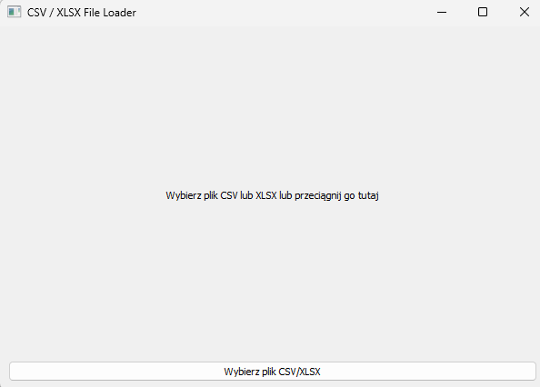

CSV/XLS Reader for Jupyter Notebook in VS Code is a PyQt-based GUI application that simplifies working with CSV and XLSX files. Featuring an intuitive drag-and-drop interface, it allows users to:
- Load and preview CSV/XLSX files effortlessly.
- Generate Jupyter Notebooks for in-depth data analysis, automatically named after the uploaded file.
Ideal for data enthusiasts and developers, this tool is open-source under the MIT License. Installation requires Python 3.x and libraries like pyqt5, pandas, and openpyxl. Contributions and feedback are welcome—try it today!

